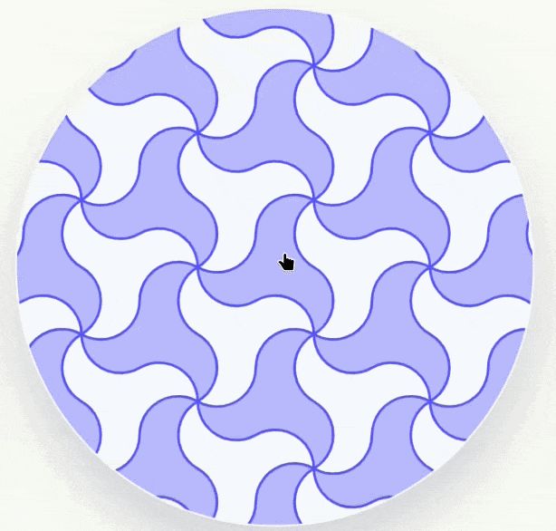

# Animating Alhambra Geometry

A web-based exhibition built for an Islamic art class, exploring the geometric symmetry behind the tile patterns of the Alhambra palace in Granada, Spain. Rather than presenting these patterns as static images, the site animates their construction and shows the four fundamental symmetries — translation, rotation, reflection, and glide reflection — at work in the tilework itself.

Live site: https://zippy-lokum-e54cc1.netlify.app/

## What the project covers

The Alhambra's tilework is among the most mathematically sophisticated decorative art ever made. Medieval Nasrid craftsmen covered the palace walls with patterns that, centuries later, mathematicians would recognize as representing all 17 possible wallpaper symmetry groups. This project focuses on two tile shapes — the Pajarita and the Airplane — and uses animation to make their underlying geometry legible.

Each section shows a different symmetry operation applied to one of these tiles: the whole plane drawing itself in, filling with color, and then performing the transformation so the viewer can watch the pattern remain identical to itself.

## How the animations work

Every component follows the same three-phase structure. First, a construction phase: for the Pajarita and Airplane base shapes, the underlying compass-and-straightedge grid draws itself line by line before the tile outline traces over it and fades the grid out. Second, a tessellation phase: dozens of tile instances appear across the plane, each one delayed by a `custom` index multiplied against a fixed step duration, so the drawing ripples outward rather than appearing all at once. Third, a transformation phase: the entire filled plane performs the relevant symmetry — sliding, rotating, flipping, or doing both simultaneously in the case of glide reflection — while a ghost copy fades in to show where it lands.

The animation sequencing is handled through Framer Motion's `Variants` system. Each component defines named states (`hidden`, `draw`, `fillIn`, `translate`, `rotate`, `scale`, `fadeIn`) and composes them by passing an array of variant names to `animate`. The timing between phases is calculated explicitly: the transformation delay is always `(number of tiles × per-tile delay) + draw duration + a pause`, so the plane is guaranteed to be fully drawn and filled before it moves.

Animations trigger on scroll using a custom `useInView` hook built on `IntersectionObserver`. When a component enters the viewport, it sets a flag that mounts the SVG, and clicking anywhere on it increments a `restartKey` that remounts the SVG from scratch — a clean way to replay an animation without resetting any React state manually.

## How the shapes are constructed

The Pajarita is defined entirely with SVG arc commands. Its outline is six arcs drawn alternately convex and concave between intersection points on a triangular grid of circles, with radii and centers derived from the grid spacing `R` and the triangle height `H = R√3/2`. The tessellation vectors that place copies across the plane follow the hexagonal lattice defined by those same constants.

The Airplane is extracted from an octagon. The octagon's eight vertices are computed trigonometrically from a central radius `R`, with vertices at angles `π/8 + n·π/4`. The tile's eight corners are then located at specific intersections of the lines connecting non-adjacent octagon vertices — points calculated using linear interpolation weighted by `√2` ratios that come from the 45-degree angles in the construction. All of this lives as inline arithmetic in the SVG `d` attribute, computed at render time.

For the rotational symmetry components, the `twoFold` and `threeFold` props select between different variant names (`rotate2times` vs `rotate4times`, `rotate3times` vs `rotate6times`), with the rotation keyframes and timing ratios defined to pause visibly at each intermediate angle before continuing.

## What I learned

I came into this project knowing React. The three things I learned from scratch were SVG, animation sequencing, and using TypeScript's type system deliberately.

SVG turned out to be its own discipline. Getting the Pajarita arcs to land on the right grid intersections required understanding how `A` commands work — radius, rotation, large-arc flag, sweep flag, endpoint — well enough to reason about them geometrically rather than by trial and error. The Airplane was harder: finding the intersection points algebraically and then expressing them as arithmetic on `octagon_x(i)` and `octagon_y(i)` functions meant the coordinate geometry had to be right before a single pixel appeared on screen.

Animation sequencing taught me that the hard part is not making things move but controlling when they move relative to each other. Framer Motion's `custom` prop and the `Variants` pattern made it possible to give each tile its own delay derived from its index while keeping all the timing logic in one place. The ghost-copy technique — rendering a second identical layer with opacity animated from 0 to 0.3 and back — came from needing to show where the transformed pattern lands without permanently changing the original layer's position.

TypeScript enforced useful constraints. Typing the `tessellationVectors` arrays as `{ dx: number; dy: number }[]` and the component props like `twoFold: boolean` and `threeFold: boolean` meant the compiler caught errors that would otherwise have been invisible geometry bugs at runtime.

The subject matter itself was the other education. Working out why the Airplane tile has 2-fold and 4-fold rotational symmetry but not 3-fold, and why the Pajarita has 3-fold and 6-fold but not 4-fold, required understanding the relationship between the underlying lattice and the symmetries it can support. That understanding is what made it possible to compute the tessellation vectors by hand rather than placing tiles by eye.

## Example

The following is an animation seen in the website 